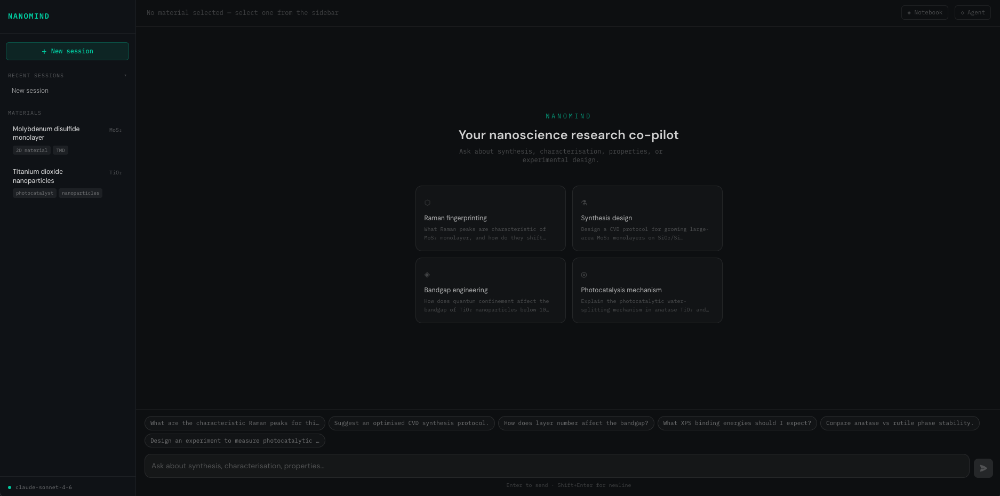
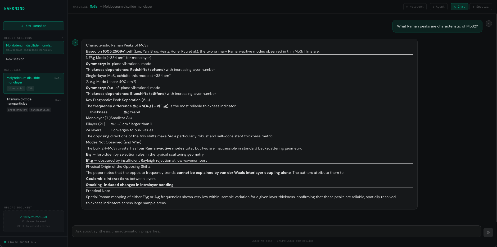
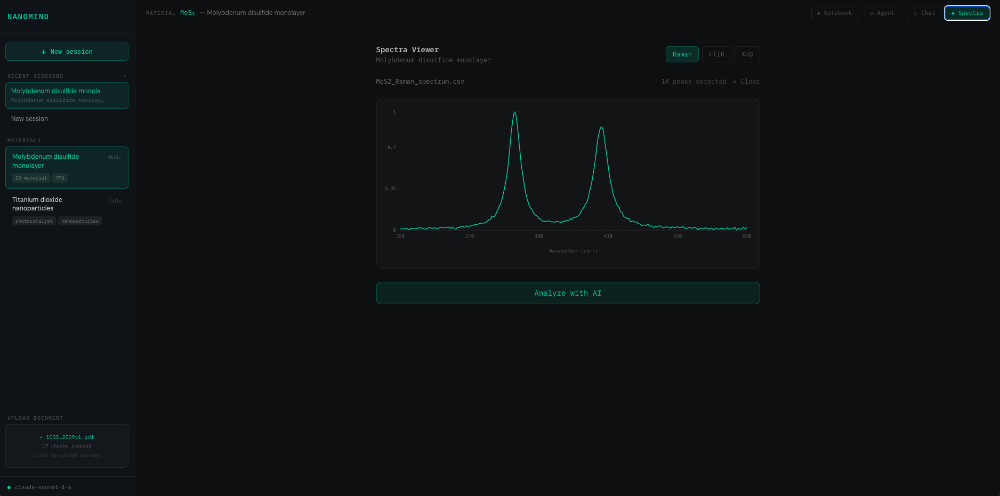
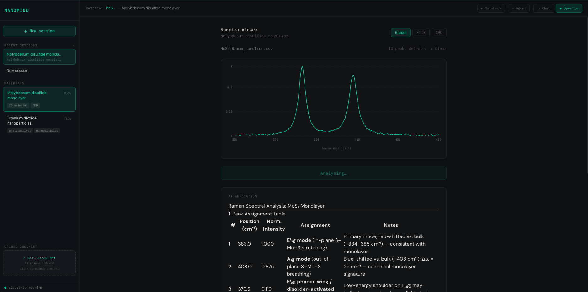
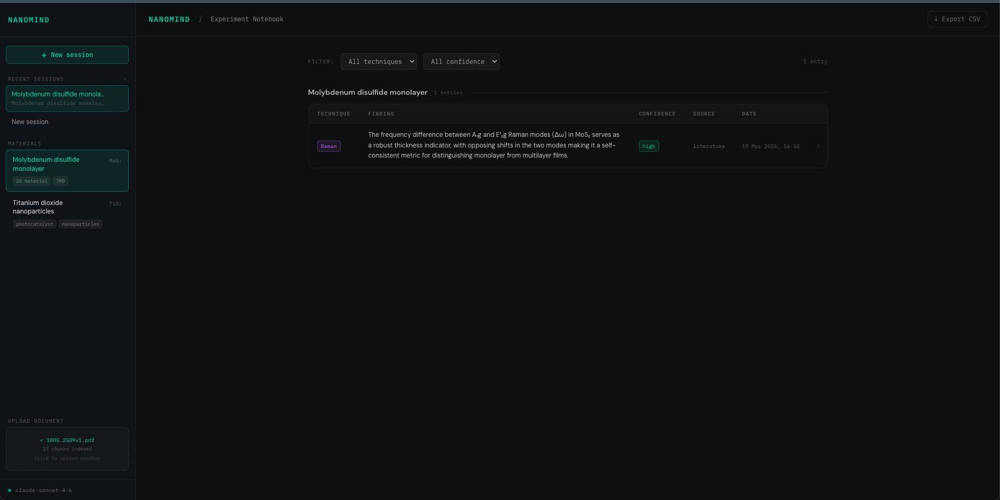

# NanoMind

AI research co-pilot for nanoscience and materials chemistry. Upload papers, ask questions grounded in the literature, visualise spectra, and automatically log experimental findings.

## Screenshots







## Features

- **RAG chat** — upload PDF/TXT papers and ask questions anchored to retrieved context (BAAI/bge-base-en-v1.5 embeddings via HuggingFace + pgvector)
- **Agent mode** — LangChain agent with Materials Project tools (crystal structure, properties) and HuggingFace QA
- **Spectra visualiser** — drop XY/CSV/TXT spectral data; AI annotates peaks in real time
- **Experiment notebook** — findings auto-extracted from every chat response and logged to a searchable, filterable table with CSV export
- **Session persistence** — conversations survive page refresh; full session history in the sidebar

## Stack

| Layer | Technology |
|---|---|
| Framework | Next.js 16.2 (App Router, Turbopack) |
| UI | React 19, Tailwind v4, Recharts v3 |
| Database | Supabase (Postgres + pgvector) |
| LLM (chat) | Anthropic claude-sonnet-4-6 |
| LLM (extraction) | Anthropic claude-haiku-4-5 |
| Embeddings | HuggingFace BAAI/bge-base-en-v1.5 (768-dim) |
| Agent | LangChain 0.3 + @langchain/anthropic |
| Auth | Supabase anon key (RLS enabled) |

## Setup

### 1. Clone and install

```bash
git clone <repo>
cd nanomind
npm install
```

### 2. Supabase

Create a project at [supabase.com](https://supabase.com) and run the schema:

```sql
-- Enable pgvector
create extension if not exists vector;

-- Materials
create table materials (
  id uuid primary key default gen_random_uuid(),
  name text not null,
  formula text,
  description text,
  tags text[],
  created_at timestamptz default now()
);

-- Sessions
create table sessions (
  id uuid primary key default gen_random_uuid(),
  material_id uuid references materials(id) on delete set null,
  title text,
  created_at timestamptz default now()
);

-- Messages
create table messages (
  id uuid primary key default gen_random_uuid(),
  session_id uuid references sessions(id) on delete cascade not null,
  role text not null check (role in ('user','assistant')),
  content text not null,
  created_at timestamptz default now()
);

-- Documents (RAG chunks)
create table documents (
  id uuid primary key default gen_random_uuid(),
  material_id uuid references materials(id) on delete cascade,
  content text not null,
  embedding vector(768),
  metadata jsonb default '{}',
  created_at timestamptz default now()
);

-- Notebook entries
create table notebook_entries (
  id uuid primary key default gen_random_uuid(),
  session_id uuid references sessions(id) on delete cascade,
  material_id uuid references materials(id) on delete set null,
  technique text not null default 'general',
  finding text not null,
  confidence text not null check (confidence in ('high','medium','low')),
  source text not null default 'AI',
  created_at timestamptz default now()
);

-- Vector similarity search function
create or replace function match_documents(
  query_embedding vector(768),
  match_threshold float,
  match_count int,
  filter_material_id uuid
)
returns table (id uuid, content text, metadata jsonb, similarity float)
language sql stable as $$
  select id, content, metadata, 1 - (embedding <=> query_embedding) as similarity
  from documents
  where material_id = filter_material_id
    and 1 - (embedding <=> query_embedding) > match_threshold
  order by embedding <=> query_embedding
  limit match_count;
$$;

-- Grant access
grant select, insert, update, delete on all tables in schema public to anon, authenticated;
grant execute on function match_documents to anon, authenticated;

-- RLS (allow all for now — add user-scoped policies for production)
alter table materials enable row level security;
alter table sessions enable row level security;
alter table messages enable row level security;
alter table documents enable row level security;
alter table notebook_entries enable row level security;

create policy "allow all" on materials for all using (true);
create policy "allow all" on sessions for all using (true);
create policy "allow all" on messages for all using (true);
create policy "allow all" on documents for all using (true);
create policy "allow all" on notebook_entries for all using (true);
```

### 3. Environment variables

Copy `.env.local.example` to `.env.local` and fill in:

```bash
# Required
NEXT_PUBLIC_SUPABASE_URL=https://xxxx.supabase.co
NEXT_PUBLIC_SUPABASE_ANON_KEY=eyJ...
SUPABASE_SERVICE_ROLE_KEY=eyJ...
ANTHROPIC_API_KEY=sk-ant-...

# Optional — enables document embeddings and agent tools
HUGGINGFACE_API_KEY=hf_...
MATERIALS_PROJECT_API_KEY=...
```

**HuggingFace token**: create a token at huggingface.co/settings/tokens with "Make calls to Inference Providers" permission enabled.

**Materials Project key**: register at next-gen.materialsproject.org and copy your API key from your dashboard.

### 4. Seed materials

Insert at least one row into the `materials` table (via Supabase dashboard or SQL):

```sql
insert into materials (name, formula, description, tags) values
  ('Titanium Dioxide', 'TiO₂', 'Wide-bandgap semiconductor used in photocatalysis.', array['photocatalysis','semiconductor']),
  ('Graphene Oxide', null, 'Oxidised graphene with functional surface groups.', array['2D material','carbon']);
```

### 5. Run

```bash
npm run dev
```

Open [http://localhost:3000](http://localhost:3000).

## Usage

1. **Select a material** from the sidebar
2. **Upload a paper** (PDF or TXT) via the Upload panel — chunks are embedded and stored
3. **Ask questions** in chat — answers are grounded in the uploaded document
4. **Switch to Agent mode** (◆ Agent button) to enable Materials Project + HuggingFace tools
5. **View spectra** — click the Spectra tab, drop an XY/CSV file, hit Analyse
6. **Browse notebook** — click ◈ Notebook to see all auto-logged findings, filter, and export CSV

## Architecture

```
app/
  api/
    chat/              # Streaming Anthropic chat with RAG injection
    agent/             # LangChain AgentExecutor with MP + HF tools
    documents/upload/  # PDF parsing + HuggingFace embeddings
    spectra/analyze/   # Streaming peak annotation
    sessions/          # CRUD for chat sessions
    materials/         # Materials list
    notebook/          # Notebook entry CRUD
  page.tsx             # Chat + Spectra tabs
  notebook/            # Experiment notebook UI
  layout.tsx           # Root layout with env validation banner

components/
  Sidebar.tsx          # Material selector, session history, upload
  MessageList.tsx      # Chat thread with markdown + retry on error
  InputBar.tsx         # Auto-resize textarea, quick-query chips
  SpectraPanel.tsx     # Spectra drop zone + AI annotation
  SpectraChart.tsx     # Recharts ComposedChart with peak markers
  EnvWarningBanner.tsx # Missing env var warnings

lib/
  chunker.ts           # RecursiveCharacterTextSplitter with section labels
  retriever.ts         # HuggingFace embed + pgvector similarity search
  agent.ts             # LangChain agent factory
  tools/               # MaterialsProject + HuggingFace tool definitions
  validateEnv.ts       # Startup env var validation
  prompts/             # Nanoscience system prompt
```
